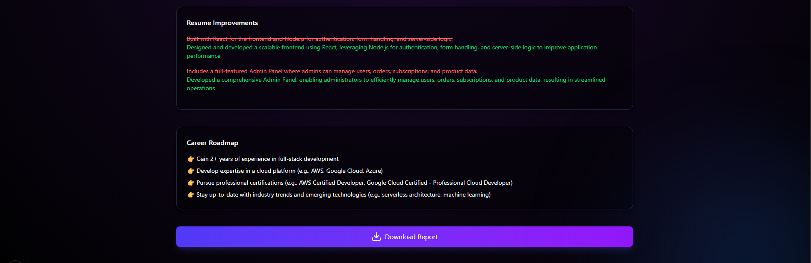
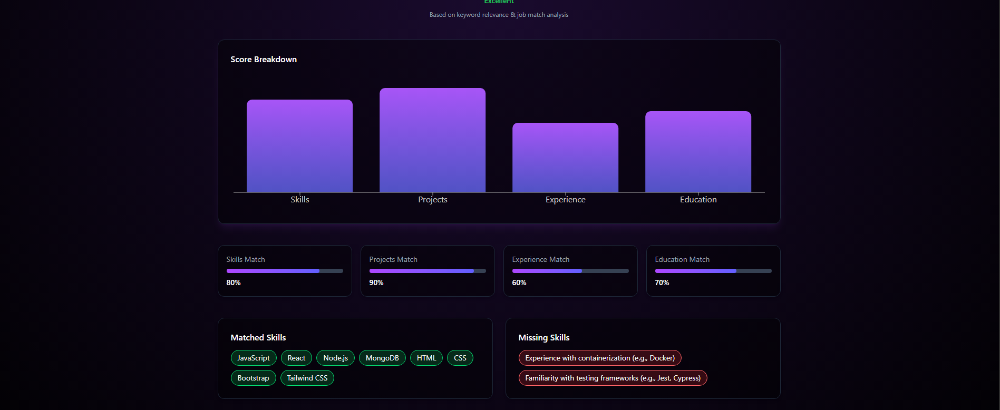
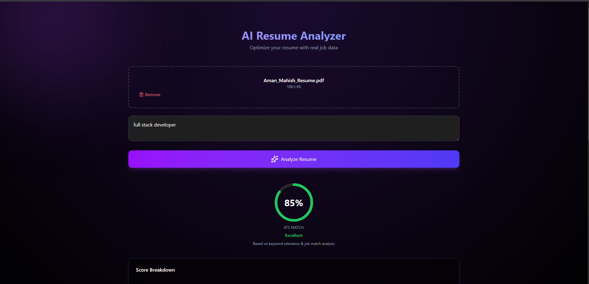

# 🚀 DocScanX — AI Resume ATS Analyzer

<p align="center">
  <b>AI-powered Resume Analyzer that simulates real ATS systems</b><br/>
  Analyze resumes, match job descriptions, and get actionable insights 🚀
</p>

<p align="center">
  
</p>

---

## ✨ Features

### 🔎 AI Resume Analysis
Upload a resume and compare it with a job description using **AI-powered reasoning (Groq Llama 3.3)**.

### 📊 ATS Score (Realistic)
Get a **real-world ATS match score** based on skills, keywords, and semantic understanding.

### 🧠 Smart Skill Matching
Identifies:
- ✅ Matched Skills  
- ❌ Missing Skills  

### 💡 Resume Improvement Suggestions
AI suggests **specific, actionable improvements** to boost your resume.

### 🔑 Keyword Scanner
Highlights which job description keywords are:
- ✔ Found  
- ✖ Missing  

### 📄 PDF Resume Parsing
Automatically extracts resume content from uploaded PDFs.

### 📊 Visual Dashboard
- Score breakdown  
- Skill cards  
- Progress bars  
- Clean SaaS-style UI  

### ⬇ Export Report
Download your ATS report instantly.

---

## 📸 Screenshots

### 🏠 Upload Interface
<p align="center">
  
</p>

### 📊 ATS Dashboard
<p align="center">
  
</p>

### 🧠 AI Resume Insights
<p align="center">
  
</p>

---

## 🛠 Tech Stack

### Frontend
- Next.js 16 (App Router)
- React
- TypeScript
- TailwindCSS
- Framer Motion (animations)
- Lucide Icons
- React Dropzone

### Backend
- Next.js API Routes
- Node.js Runtime
- Groq API (Llama 3.3 70B)

### Utilities
- pdf-text-extract
- File handling (fs, path, os)

---

## ⚙️ Installation

```bash
git clone https://github.com/MaximuxR93/DocScanX.git
cd DocScanX
npm install
